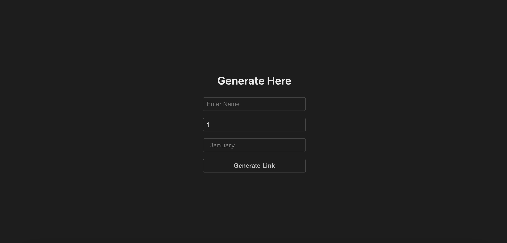
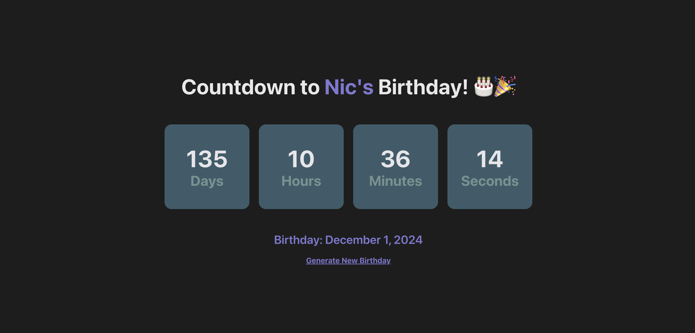
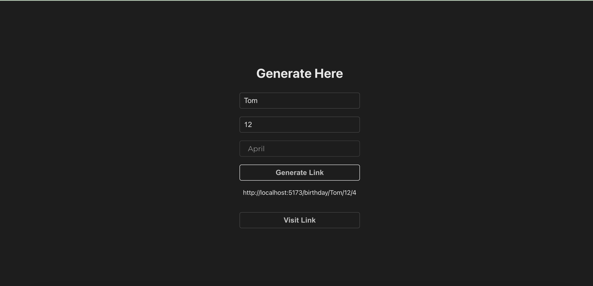

# 🎉Birthday Countdown!🎉

Made with React.

## Getting started

You can view a live demo over at http://localhost:5173/

To get It running locally:

- Clone this repo
- `npm install` to install all req'd dependencies
- `npm run dev` to start the local server (this project uses vite)

## Usage:

Visit [http://localhost:5173/]()

Click on Generate Link
or Head to [http://localhost:5173/generate]()

Enter the `name , day , month of birthday`

Click on Generate Link

You Can see a Link being generated Copy or Visit the link by Clicking on the Button

And There You Go ! 🎉

## ScreenShot of Coutdown Timer⏲️

## ScreenShot of The Link Generator⏲️

